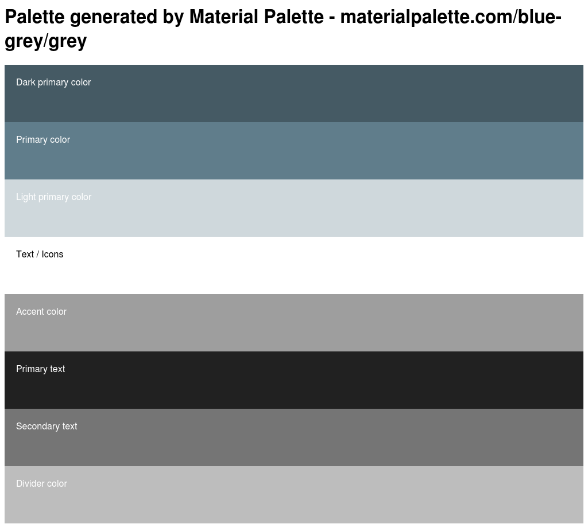

# code-labs
A project that consumes an API and displays the developers from Nairobi

### [Wire Frame](https://marvelapp.com/b6098ja/screen/54563142)
I used [marvel app](https://marvelapp.com/) because
* of its ease to add transitions and gestures
* no account is needed to view the mock up design
* it contains default layouts that can be added and edited accordingly

### Color Palette

